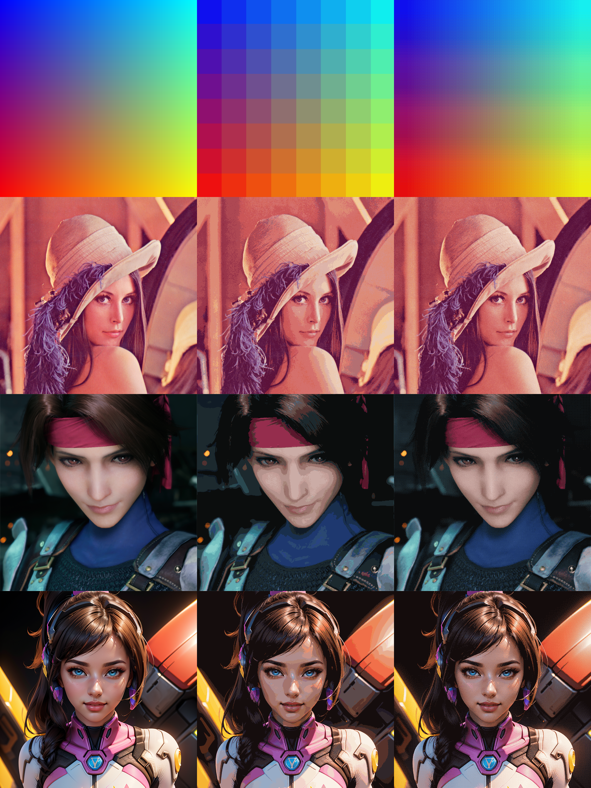

## Color Reduction

Reduce color information (quantization) of a 24-bit RGB bitmap down to 8-bit palette-based bitmap.

### Compile

```
make
```

or 

```
mingw32-make	# for MinGW32/64 users
```

or 

```
makedos.bat		# MS-DOS target
```

No external dependencies required. It was tested on **macOS Monterey** (clang) **Windows 10** (LLVM MinGW64) and **MS-DOS** (DJGPP).

### Usage

```
./unipal input.bmp [dither]
```

Whereas:

* `input.bmp`: image to be quantized, must be a 24-bit Windows bitmap.
* `dither`: enable dithering using 4x4 ordered matrix

Output image will be stored as a 8-bit Windows bitmap under the name `output.bmp`.

### Preview

**Left**: Original; **Middle**: 8-bit undithered; **Right** 8-bit dithered.


